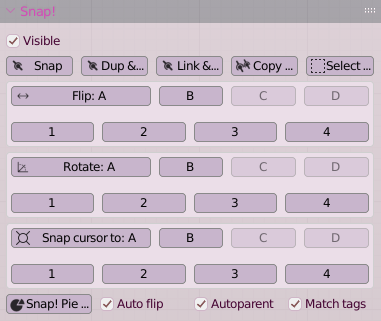
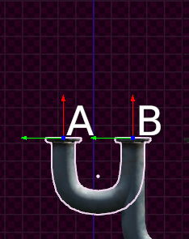

# **Snap\!**

## ***Connecting modular assets in a snap***

Snap\! Is an add-on that lets you define snap-points on objects and provides an easy-to-use, interactive way of snapping objects together.

Snapping an object to another object will position it at the chosen snap-point and align the object in such a way that the object's orientation matches that of the snap-point on the other object.

This makes it possible to add sensible snap-points to objects in a modular asset pack for example. If later this collection of objects is appended to your scene, you can easily position and align them together.

[This playlist](https://youtube.com/playlist?list=PLxyAbGpHucHZpoPBYVe8u2xWwIHP8p3yu) shows examples of what is possible:

[Using Snap\!](https://youtu.be/3yMTV_DyMTg) Is a short introduction on working with objects that have snap-points configured.

[Creating snap-points](https://youtu.be/0y-4aiBhqT0) show how to configure snap-points on a collection of objects.

[New features 2021-9-17](https://youtu.be/v0B6lFECMxw) demonstrates the new features added in September 2021\.

[Tip: position snap-points on flexible curve based objects](https://youtu.be/hvkEr76f5PA)  short tip.

[New features 2022-4-2](https://youtu.be/5oaUUVgVrxY) demonstrates the new features added in April 2022\.

**Table of contents**

[Changelog](#changelog)

[License](#license)

[Installation](#installation)

[Installing an updated version of Snap\!](#installing-an-updated-version-of-snap!)

[Workflow](#workflow)

[Options reference](#options-reference)

[Snap\! Panel](#snap!-panel)

[Visible](#visible)

[Snap, Dup & Snap, Link & Snap](#snap,-dup-&-snap,-link-&-snap)

[Copy to selected](#copy-to-selected)

[Select neighbors](#select-neighbors)

[Flip](#flip)

[Rotate](#rotate)

[Snap Pie Menu](#snap-pie-menu)

[Auto flip](#auto-flip)

[Auto parent](#auto-parent)

[Move selected](#move-selected)

[Match tags](#match-tags)

[Snap 3d cursor to snap-point](#snap-3d-cursor-to-snap-point)

[Point definitions panels](#point-definitions-panels)

[Enable / Disable Snap\!](#enable-/-disable-snap!)

[Disable / Enable](#disable-/-enable)

[Label & color](#label-&-color)

[Loc & Set location](#loc-&-set-location)

[Dir & Set direction / Set direction to normal](#dir-&-set-direction-/-set-direction-to-normal)

[Up & Set up](#up-&-set-up)

[Right](#right)

[Angle](#angle)

[Scale](#scale)

[Reset](#reset)

[Cycle](#cycle)

[Tags & Accept tags](#tags-&-accept-tags)

[Add-on preferences](#add-on-preferences)

[Visible](#visible-1)

[Create Ctrl-K Shortcut](#create-ctrl-k-shortcut)

[Label Size, Shadow & Offset](#label-size,-shadow-&-offset)

[Label color override and color](#label-color-override-and-color)

[Widget colors & size](#widget-colors-&-size)

[Highlight colors](#highlight-colors)

[Auto flip](#auto-flip-1)

[Autoparent](#autoparent)

[Move selected](#move-selected-1)

[Match tags](#match-tags-1)

[Frequently Asked Questions](#frequently-asked-questions)

[Can I add snap-points to objects other than meshes, curves or lattices?](#can-i-add-snap-points-to-objects-other-than-meshes,-curves-or-lattices?)

[Set Direction to Normal behaves weirdly, what's up?](#set-direction-to-normal-behaves-weirdly,-what's-up?)

[The panel with Extra point definitions is empty?](#the-panel-with-extra-point-definitions-is-empty?)

[I don't see the filter and sort options in the Extra point definitions, what should I do?](#i-don't-see-the-filter-and-sort-options-in-the-extra-point-definitions,-what-should-i-do?)

[I see weird red, green or blue triangles or lines all over the place, what causes this?](#i-see-weird-red,-green-or-blue-triangles-or-lines-all-over-the-place,-what-causes-this?)

[Acknowledgments](#acknowledgments)

# Changelog

| Date | Version |  |
| :---- | :---- | :---- |
| 22 August 2021 | 202108221357 | Initial release |
| 5 September 2021 | 202109051421 | Added [Set Direction to Normal](#dir-&-set-direction-/-set-direction-to-normal) Bug fix: Flip no longer inverts object  |
| 17 September 2021 | 202109161626 | Added [Pie Menu](#snap-pie-menu) for snap operators [Auto flip](#auto-flip) option [Shift left click](#snap,-dup-&-snap,-link-&-snap) won't snap but keeps location New [preference](#add-on-preferences) to set size of arrows Plus minor bug fixes |
| 30 September 2021 | 202109300942 | Easy snap-points for Bezier curves Easy snap-points for Lattice objects [Dup & Snap and Link & Snap](#snap,-dup-&-snap,-link-&-snap) [Copy snap-points](#copy-to-selected) to selected objects New [preference](#add-on-preferences) override label color Plus minor bug fixes |
| 26 March 2022 | 20220326151712 | [Select neighbors](#heading=h.k2mcd32wjg5y) [Snap 3d cursor to snap-point](#snap-3d-cursor-to-snap-point) [Autoparent](#auto-parent) Gizmo scale in real world units |
| 2 April 2022 | 20220401091547 | Extra points Tags |
| 3 July 2022 | 20220703124704 | Small bugs fixed Tested on Blender 3.2 |
| 24 September 2022 | 20220918152940 | Small bugs fixed Tested on Blender 3.3 |
| 11 December 2022 | 20221211154820 | Move all selected objects |
| 4 November 2023 | 20231013101725 | Blender 4.0 compat release |
| 28 April 2025 | 20250428135306 | Free release |

# 

# License

**The Snap\!** user manual © 2025 by [Michel Anders](https://github.com/varkenvarken) is licensed under CC BY-NC-SA 4.0

**The Snap\!** source code © 2025 by [Michel Anders](https://github.com/varkenvarken) is licensed under GPL:

**Snap\!**, position modular assets with ease.

(c) 2021 \- 2025 Michel Anders (varkenvarken)

This program is free software; you can redistribute it and/or  
modify it under the terms of the GNU General Public License  
as published by the Free Software Foundation; either version 2  
of the License, or (at your option) any later version.

This program is distributed in the hope that it will be useful,  
but WITHOUT ANY WARRANTY; without even the implied warranty of  
MERCHANTABILITY or FITNESS FOR A PARTICULAR PURPOSE.  See the  
GNU General Public License for more details.

You should have received a copy of the GNU General Public License  
along with this program; if not, write to the Free Software Foundation,  
Inc., 51 Franklin Street, Fifth Floor, Boston, MA 02110-1301, USA.

# Installation

Installing Snap\! for the first time is simple:

* Unpack the .zip file   
  you probably already have done that as it contains this document (**Snap-User-Manual.pdf**) and the add-on itself (an archive with Python files, **snapper.zip**)

* Select Edit → Preferences → Add-ons from the menu  
* Click ‘Install …’ (near the top of the screen) and select the **snapper.zip** file  
* Click ‘Install Add-on’ (near the bottom right of the screen)  
* Check the enable check box to the left of the add-on you just installed

The add-on will now be available in the toolbar of 3d-view (press N in the 3d-view if the toolbar is not visible). The operators and properties of any defined snap-point will be available in the Snap\! Panels, although most of them will only show if snap-points are enabled on an object.

## Installing an updated version of Snap!

If you want to replace a previous version of Snap\! you have to remove the old version first. to do this, go to Edit → Preferences … → Add-ons and either search for Snap\! or go to the ‘Object’ category where it will be located. Click on the add-on and then on the ‘Remove’ button. After removing the old version, follow the instructions above to install the new version.

# Workflow

Snap\! is a tool to make positioning modular assets easier. There are two typical workflows: defining snap-points on objects and positioning objects using those snap-points.

*Defining snap-points* is typically done once. Once the snap-points are defined, the object collection can then be saved as usual and appended to any .blend file later. All the necessary tools to define snap-points on an object are grouped inside the Points and Extra points panels in the 3d-view. You can define any number of snap-points on an object, the first four in the Points panel and any extra ones in the Extra points panel.

An example point definitions panel is shown on the left. This example shows a panel for an object that has two snap-points configured.

The configuration options are explained in detail in the section [Point definitions panel](#point-definitions-panels)

**Tip**: if you define your snap-points with their direction vector pointing consistently pointing all outward, and the user enables  [Auto flip](#auto-flip-1), you will greatly reduce the number of times a user needs to flip an object after snapping it. You can use [Set direction to normal](#dir-&-set-direction-/-set-direction-to-normal) when defining those points.

*Positioning objects using snap-points* can be done for any collection of objects that has snap-points defined. You can append an asset collection with defined snap-points and then start positioning them.

When you make copies of an object the snap-point definitions are copied too, so a typical workflow will involve copying and then snapping an object to another object multiple times. 

The tools to snap objects together are located in the Snap\! panel in the 3d-view and an example is shown in the image on the right. The layout of this panel is updated automatically to reflect the number of snap-points defined on an object.

The point definition options are explained in detail in the section [Snap\! Panel](#snap!-panel)

# Options reference

Both workflows described earlier come with operators and options in their own panels.

When you are working with a collection of assets that has been configured with snap-points you will use the Snap\! panel to snap, flip and rotate assets. This panel will be visible if the active object has snap-points defined.

The Point definitions panels are closed by default and can be used to add and configure snap-points on the active object.

## Snap! Panel

The Snap\! panel will show the operations you can perform on the active object if this object is configured to have snap-points.

The flip, rotate and snap cursor buttons for the individual snap-points will only be active if the corresponding snap-point is enabled on the active object.

The panel will adapt itself to the number of snap-points configured on an object. The image shows an object with 8 points (4 basis points and 4 extra points) where some of the points are disabled.

### Visible

When you are done positioning your modular assets or you want to focus on something else for a while, you can toggle the visibility of all snap-point labels to declutter your 3d view.

This will not remove any information from the objects; if you enable visibility again everything becomes available again with their previous settings.

### Snap, Dup & Snap, Link & Snap

Will allow you to move the active object and interactively select a pair of snap-points. This pair of points, one on your active object and one on another object that is nearby, will be highlighted by a blue and green circle respectively.

A left mouse click will snap the blue point on the active object to the green point on another object. If no points are highlighted the active object will return to its original position.

A right mouse click will also return the active object to its original position.

If you hold the Shift-key when left clicking, the object is not snapped but does stay at its new location. This is useful when objects are far from the plane perpendicular to the camera and will not snap. You can leave the object near the object you want to snap to, shift left mouse click, and then move the view and try again.

The active object will move in a plane parallel to the camera/view, so if you are not able to highlight a pair of points the objects might be too far from this plane to select. In that case, right-mouse click to exit the snap operation and change your viewpoint; then try again.

When the active object is snapped in position, it is rotated such that the (red) direction vectors and (blue) up vectors are aligned. This might not always be what you want. See the Flip and Rotate operators for more options.

 

Flipped asset		      Corrected by clicking Flip B

**Dup & Snap** will duplicate the active object first before it lets you snap the new copy to another object. **Link & Snap** is similar but will make a linked copy first. Both actions make it easier to select from a group of modular assets without moving the originals.

### Copy to selected

Will copy the snap-points from the active object to all selected objects.

### Select neighbors

Select objects that have overlapping snap-points with selected objects. If the All option is checked it will recursively select the neighbors or neighbors of …

### Flip

When snapping together two objects their direction (red) vectors are aligned. This may not always be what you want because sometimes this will result in the active object being 180 degrees opposite to the desired orientation.

This is where the Flip operator comes in: by default, it will switch the orientation of the active object around its A snap-point.

If the active object shares snap-points with multiple other objects, you can use the B, C, or D buttons to flip around a different snap-point.

### Rotate

Snapping objects together will result in both the direction (red) vectors and the up (blue) vectors being aligned, but sometimes it makes sense to rotate the snapped object around the direction vector. 

Every snap-point has a predefined snap-angle that is typically chosen to match features in an asset. For example, the modular pipe assets all have 8-fold symmetry with 8 bolts positioned around the ends of each pipe. The snap-angles in that same example have been set to 45 degrees, so every click on Rotate will rotate the asset in such a way that all bolts stay aligned.

Rotation is always in the same direction, so you may need to click a few times to get your object oriented just right.

### Snap Pie Menu

This button will show a pie menu when clicked with all the snap operators. This isn't very useful in itself but it makes it easy to add this menu to the Quick menu (by right mouse clicking it). Quick menu items are shown near the mouse pointer so you will have the buttons in the menu near where you are working, so no need to move all the way to the panel on the right.

### Auto flip

This will align the object you are snapping to another object with its direction vector opposite to the direction vector of the point you are snapping to. If snap-points on objects are consistently defined with their direction vectors pointing outward, this will greatly reduce the number of times you will need to flip an object after it has been snapped into position.

### Auto parent

This will automatically parent the object that is snapped to its target.

### Move selected

This will move any additional selected objects along with the objects being snapped.

Their relative positions and orientations will be kept the same.

### Match tags

With this option selected, objects can only be snapped to other objects when the tags defined on their snap-points match. 

### Snap 3d cursor to snap-point

Will move the 3d-cursor to the position of the selected snap-point of the active object.

## Point definitions panels

This panel allows you to configure an object for easy snapping. Once enabled you can define any number of snap-points on an object. The first four points are defined in the Point definitions panel, any extra points are defined in the Extra point definitions panel. Other than the panel they are in, their functionality is exactly the same.

The image shows the configuration options for the first snap-point.

### Enable / Disable Snap!

Clicking this button will enable (or disable) all snap-points for the active object.

When you start adding snap functionality to a collection of modular assets, you first need to select each of those objects and Enable Snap\! You can also disable it again if you don't want the object to have snap functionality.

Once enabled you can configure any number of snap-points. Snap-point A will be enabled by default and snap-points B, C and D will be present but disabled. No extra snap-points will be present by default, but can be added at will.

Each snap-point has a set of properties that will be editable once that point is enabled.

### Disable / Enable

Enable or disable this snap-point. Disabling a snap-point will make its properties uneditable and hide its visibility in the 3d-view and prevent it from being snapped. It effectively removes a snap-point from an object, but the last configured values will be restored if enabled again.

### Label & color

Each snap-point can have a distinct label that will be shown near the snap-point's location in the 3d-view. The color of this label can be chosen as well. The size, relative offset, and drop shadow are considered accessibility features and can be configured in the add-on preferences. A user can also override the color in the preferences.

### Loc & Set location

The location of a snap-point can be configured manually or set to the average location of all selected elements by clicking Set location. Set Location is only enabled if the object is in edit mode and is a mesh, curve, or lattice.

When snapping an object it will be moved in such a way that the locations of the selected snap-points coincide.

### Dir & Set direction / Set direction to normal

The principal direction (shown as a red arrow by default) of a snap-point can be configured manually or set to the average location of all selected elements by clicking Set Direction. Set direction is only enabled if the mesh is in edit mode and is a mesh, curve, or lattice.

You can also set the direction to be parallel to the normal of the selected elements. Set direction to Normal is only enabled if the object is in edit mode and is a mesh, curve, or lattice. In a mesh object, you should have selected faces for this to work as expected as having only vertices selected will get you the average of the vertex normals. For curve or lattice objects the normal is calculated for the (imaginary) polygon that is defined by the selected points. This works best for selections of three points.

When snapping an object it will be oriented in such a way that the principal directions of the selected snap-points are aligned.

### Up & Set up

The up vector of a snap-point (shown as a blue arrow by default) can be configured manually or set to the average location of all selected elements by clicking Set up. Set up is only enabled if the object is in edit mode and is a mesh, curve, or lattice.

When snapping an object it will be oriented in such a way that the up vectors of the selected snap-points are aligned.

### Right

The right vector of a snap-point (shown as a green arrow by default) cannot be configured but is calculated to be perpendicular to both the principal direction and the up vector.

### Angle

The snap angle determines how many degrees the object will be rotated around its principal direction when the user clicks the Rotate button. If for example, an object has an obvious fourfold symmetry around this axis you might set this to 90\.

### Scale

The scale determines the size of the snap-point vectors as shown in the 3d-view. Initially, it is set to match the size of the object but can be adjusted to appear larger or smaller. 

### Reset

Clicking reset will set all snap-point vectors, their location, and scale to the defaults.

### Cycle

Clicking Cycle will select alternative configurations for the snap-point vectors. The default is to have the principal direction along the local x-axis and the up vector along the local z-axis, but by clicking Cycle you can get other common choices, for example with the principal axis along the local y-axis or the negative x-axis.

### Tags & Accept tags

Each of those fields can contain a comma separated list of tags. If [match tags](#match-tags) is enabled in the Snap\! panel, this snap-point can only be snapped to another snap-point if one of its tags matches one of the accept tags in the target object. The converse is true also: this snap-point can only be snapped to, if the tag on the snap-point on the object matches one of the accept tags.

## Add-on preferences

 {#add-on-preferences}

The look of several aspects of the Snap\! add-on can be controlled with the options in the preferences. This makes it possible to match the colors with your theme for example.

### Visible

This option is available in the Snap\! panel in the 3d-view as well.

When you are done positioning your modular assets or you want to focus on something else for a while, you can toggle the visibility of all snap-point labels to declutter your 3d view.

This will not remove any information from the objects; if you enable visibility again every snap-point becomes available again with their previous settings.

### Create Ctrl-K Shortcut

If enabled, a Ctrl-K shortcut will be added to the 3d-view that will start the interactive snap for the active object.

This is off by default because not everybody likes adding all kinds of shortcuts. An alternative is adding the Snap operator to the quick menu by right-mouse clicking on the button in the Snap\! panel and selecting 'Add to Quick Favorite'. 

### Label Size, Shadow & Offset

These options let you control the font size of the labels and whether they have a subtle drop shadow. The offset controls how far from the snap-point a label is displayed.

### Label color override and color

If checked the color defined here will be used to display the labels of the snap-points, regardless of what color was defined for them.

### Widget colors & size

The color selectors let you control the appearance of the arrows in a snap-point widget. It is also possible to set the line width of the arrow and the size of its head.

### Highlight colors

These color selectors let you control the appearance of the highlighted points when snapping interactively.

### Auto flip

This option is available in the Snap\! panel in the 3d-view as well.

This will align the object you are snapping to another object with its direction vector opposite to the direction vector of the point you are snapping to. If snap-points on objects are consistently defined with their direction vectors pointing outward, this will greatly reduce the number of times you will need to flip an object after it has been snapped into position.

### Autoparent

This option is available in the Snap\! panel in the 3d-view as well.

This will automatically parent the snapped object to the target object.

### Move selected

This will move any additional selected objects along with the objects being snapped.

Their relative positions and orientations will be kept the same.

### Match tags

This option is available in the Snap\! panel in the 3d-view as well.

With this option selected, objects can only be snapped to other objects when the tags defined on their snap-points match. 

# Frequently Asked Questions

#### Can I add snap-points to objects other than meshes, curves or lattices?

Yes, you can but configuring the location, direction, and up vector can currently only be done manually, so unlike with meshes, curves or lattices, the option to select some elements in edit mode and then clicking a button to set the location, direction, or up vector is grayed out.

Once configured, the snap-point functions exactly the same regardless of the type of object.

#### Set Direction to Normal behaves weirdly, what's up?

This normal is calculated on the average face or vertex normals of the selected elements. If this average is a vector of length zero or if your selection contains tiny faces the normal might be ill-defined. In this case you are better off selecting a face or vertex in the general direction and clicking Set Direction.

#### The panel with Extra point definitions is empty?

Initially it will be. Click on the plus button to add one or more extra points. If you already have extra points you can also click on the small plus in any point to add another one (or on the minus button to remove it).

#### I don't see the filter and sort options in the Extra point definitions, what should I do?

Those are probably hidden and you can unhide them by clicking on the tiny triangle on the left:

  ⇓

#### I see weird red, green or blue triangles or lines all over the place, what causes this?

You might be on a Mac with and this might be related to your video card. No solution is known at the moment.

# Acknowledgments

The modular asset pack that is used in the examples and is provided in the downloads with configured snap-points are not my work but come from [https://polyhaven.com/](https://polyhaven.com/) .

[https://polyhaven.com/a/modular\_industrial\_pipes\_01](https://polyhaven.com/a/modular_industrial_pipes_01) (CC0 by Jorge Camacho)

Another excellent pack you might try is

[https://polyhaven.com/a/modular\_airduct\_rectangular\_01](https://polyhaven.com/a/modular_airduct_rectangular_01) (CC0 by James Ray Cock)

You might be interested to support them on [https://www.patreon.com/polyhaven](https://www.patreon.com/polyhaven)

